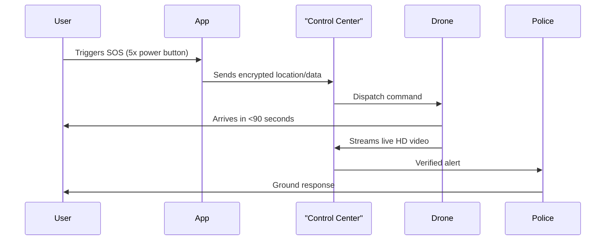

# HelpNet - AI-Powered Emergency Response System 🚨

## Next-Generation Emergency Assistance

**HelpNet** transforms emergency response by fusing cutting-edge mobile technology with autonomous drones. Our patented, AI-driven system delivers instant, intelligent assistance—when every second counts.

---

## 🚀 Overview

HelpNet is designed to save lives and deter crime through rapid, autonomous intervention. With just five presses of your phone’s power button, you discreetly summon help—triggering a powerful chain of AI, drones, and real-time response.

---

## 🌟 Key Features

### 🔴 Smart SOS Activation
- **Discreet Trigger:** Activate SOS by pressing the power button 5x—hidden from potential threats.
- **Instant Drone Dispatch:** AI-driven system sends autonomous police drones to your location.
- **Real-Time Location Sharing:** Secure GPS coordinates sent directly to authorities and verified responders.

### 🚁 Integrated Drone Response *(Patent Pending)*
- **Ultra-fast Arrival:** Drones typically reach the scene within 60 seconds—much faster than ground response.
- **Live HD Video Streaming:** First responders receive real-time situational video, improving decision-making.
- **Crime Deterrent Suite:**
  - 120dB Siren
  - Automated voice warnings
  - Strobe lights for visibility
  - Facial recognition for suspect identification

### 🗺️ Intelligent Emergency Mapping
- **3D Threat Visualization:** AI processes aerial footage for a comprehensive situational map.
- **Hotspot Prediction:** Machine learning identifies and highlights high-risk locations.
- **Swarm Coordination:** Multiple drones autonomously cooperate for large-scale incidents.

### 📹 Evidence Preservation
- **Automatic Evidence Capture:** 30-second pre-SOS video/audio buffer ensures nothing is missed.
- **Blockchain-Verified Storage:** Tamper-proof, cryptographically-secured evidence chain.
- **Smart Redaction:** AI automatically blurs bystanders to protect privacy.

---

## 🏆 Patent-Pending Innovations

- **Civilian-to-Drone Emergency Network:** First ever direct civilian-to-drone alert system.
- **AI Triage:** Automated prioritization of emergencies by threat level.
- **Verified Responder Network:** Community alerts reach trusted, verified responders.
- **5G-Enabled Command:** Ultra-low latency drone and data control for rapid response.

---

## ⚙️ Technical Specifications

### 📱 Mobile Application
- **Platform:** Android 10+ (Kotlin)
- **Location:** GPS, GLONASS, Galileo integration
- **Security:** End-to-end encrypted communications

### 🚁 Drone Hardware
- **Operational Range:** 8km radius per drone station
- **Flight Time:** 45 minutes (swappable batteries)
- **Sensors:**
  - 4K/60fps stabilized camera
  - Thermal imaging
  - LiDAR for precise 3D mapping
  - Decibel meter (gunshot detection)

---

## 🔄 User Flow



---

## 🛣️ Future Roadmap

### 2024 Q4
- Wearable integration (smart watches/rings)
- Voice-activated SOS in 12 languages
- Drone-delivered medical supplies

### 2025
- Autonomous ambulance coordination
- AR guidance for first responders
- Predictive crime prevention alerts

---

## ⚖️ Legal Notice

*The drone response system described herein is protected by patents and pending applications. Unauthorized commercial use is strictly prohibited.*

---

## 📞 Contact

For partnerships, collaborations, or technical inquiries:  
**Email:** [nirajsahani2004@gmail.com](mailto:nirajsahani2004@gmail.com)  
**Phone:** +91 6202714697

---

> **HelpNet:** When every second counts, let AI and drones work for your safety.

---

## Developer Notes - Local setup

- Set backend URL in `app/src/main/java/com/example/helpnet/network/ApiClient.kt` by replacing `BASE_URL` with your server base URL (must include trailing slash).
- If your backend requires authentication, set `ApiClient.authToken = "YOUR_BEARER_TOKEN"` at app start (for example in `MainActivity.onCreate`).
- CameraX background recording and WorkManager are used for reliable uploads. Test on a real device.

Build and install (from repo root):
```bash
./gradlew :app:assembleDebug
adb install -r app/build/outputs/apk/debug/app-debug.apk
```
